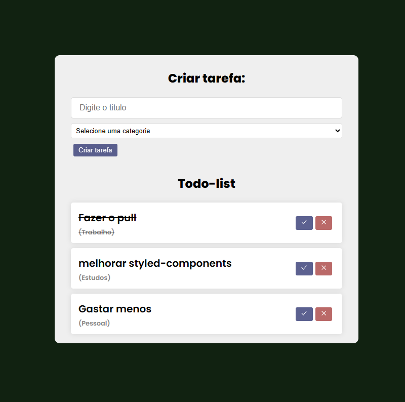

<h1 align="center">Lista de tarefas</h1> 

========

# Tecnologias

 * React⚛️
 * JavaScript✔️
 * Styled-components✔️

========

 # Funcionalidades

 * Adicionar Tarefas
 * Excluir Tarefas

========

## Veja como é: 

<h1 align="center">
  
</h1>

========

Feito por <a href="https://www.linkedin.com/in/mickaias-kaw%C3%A3-348340233/">Mickaias Nunes</a>🚀🚀

